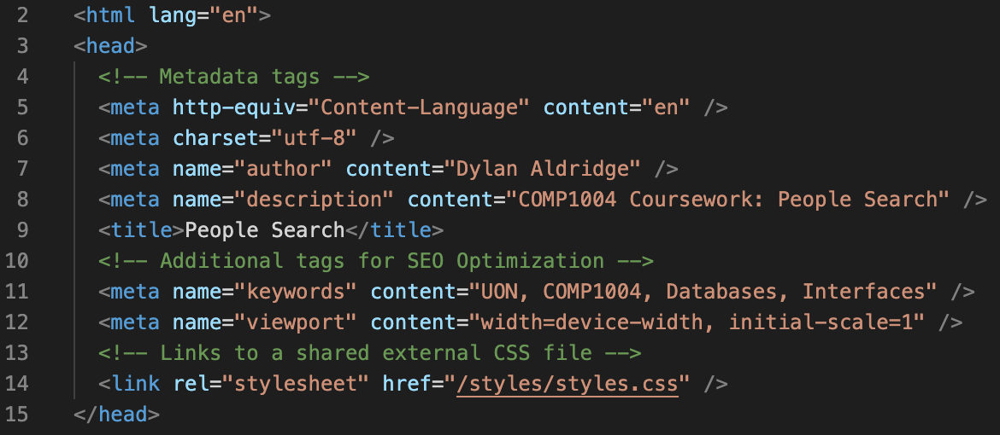

# README Report

## Overview
This project is developed as part of the COMP1004 coursework. It involves creating a front end using HTML, CSS, and JavaScript that interfaces with a Supabase database to manage and search records of people and vehicles. The main functionalities include:
- Searching for people by name or driving license number.
- Searching for vehicles by registration, make, model, or color.
- Adding new vehicles to the database, including assigning existing or new owners.

## HTML

1. There are 3 HTML pages: [index.html](index.html), [vehicle-search.html](./pages/vehicle-search.html), and [vehicle-add.html](./pages/vehicle-add.html)
2. As seen through the above pages, all files are correctly named
3. All pages contain the correct metadata including language, character set, title, author, description, viewport, and keywords for SEO optimisation. Here is an example from index.html: 
4. Heading and text elements have been used appropriately: Here are examples of their uses from vehicle-search.html: 

## CSS

## Javascript and Database

## Failed Tests

## Additional Work
- Enhanced the user interface with better styling and responsiveness.
- Added detailed error handling and feedback messages.
- Ensured accessibility compliance with a Lighthouse accessibility score of 100.
- Added Selection menu to make a simpler UI and improve UX
