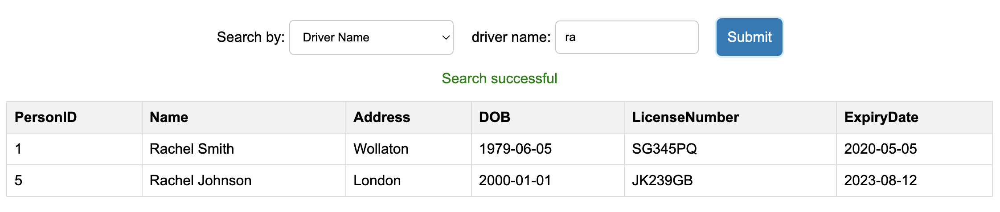

# Project Report

## Overview
This project is developed as part of the COMP1004 coursework. It involves creating a front end using HTML, CSS, and JavaScript that interfaces with a Supabase database to manage and search records of people and vehicles. The main functionalities include:
- Searching for people by name or driving license number.
- Searching for vehicles by registration, make, model, or color.
- Adding new vehicles to the database, including assigning existing or new owners.

## HTML

1. There are 3 HTML pages: [index.html](index.html), [vehicle-search.html](./pages/vehicle-search.html), and [vehicle-add.html](./pages/vehicle-add.html)
2. As seen through the above pages, all files are correctly named
3. All pages contain the correct metadata including language, character set, title, author, description, viewport, and keywords for SEO optimisation. Here is an example from index.html: 
4. Heading and text elements have been used appropriately: Here are examples of h2 and label being used from vehicle-search.html: 
5. An unordered list has been used to create the navigation links: 
6. All of the pages have the above code and as such have the saem menu and same functionality
7. All 3 pages have header, aside, main, and footer tags wrapped in a container div
8. Each page uses the saem image in the aside with additional information provided in the CSS:  
9. 'Lighthouse' accessibility test is at 100: 

## CSS

1. All pages are linked to the same external CSS file - [styles.css](styles/styles.css). Here is an example of it being linked: 
2. CSS Flex has been used to place the navigation links horizontally and only apply to ul that are in the navigation links: 
3. Location selector has been used to remove the bullet point from the nav list: 
4. Border, margin, and padding have been added to header, sidebar, main and footer in [styles.css](styles/styles.css)) (lines 15-85).
5. CSS has been used and applied using a container div with ID 'container' with correct ratios:   The placing of content is done in each individual component (e.g.):  The final grid layout looks as such: 
6. On screen sizes less than 500px, a media query has been used to change the grid layout:  As such, the final grid layout appears as the following: 

## Javascript and Database

1. Users can search for people by name:  or by license number:  It also returns partial matches:  and multiple matches:  If there are no matching entries, it also returns an appropriate response:   This is achieved using the search (lines 15-44) and fetchOwner (lines 47-71) functions in [people.js](/scripts/people.js)
2. Users can search for vehicles by registration number with all apropriate details being displayed:  This also works for entries with missing data:  This is achieved using the search (lines 14-43) and fetchData (lines 46-70) functions in [vehicleSearch.js](/scripts/vehicleSearch.js)
3. Users can enter details for the vehicle they are searching for:  If the owner already exists, then a dropdown menu is provided to select the correct owner [vehicleAdd.js](/scripts/vehicleAdd.js) (lines 92-133):  If the owner does not exist, then a new form to add a new person is provided [vehicleAdd.js](/scripts/vehicleAdd.js) (lines 136-171):  On 'Add owner', the person is added to the database [vehicleAdd.js](/scripts/vehicleAdd.js) (lines 174-206). On 'Add vehicle', the vehicle is added to the database [vehicleAdd.js](/scripts/vehicleAdd.js) (lines 235-)270.

## Failed Tests

- Search "rachel" should return two records: This test attempts to access the ID 'name'. However, as I have used a selector instead of multiple inputs along with a 'dyamicInput' ID, this test will fail. The search still works appropriately as required: 
- Search "KWK24JI" should return tesla but no owner: Similar to the previous failed test, this test attempts to access the ID 'rego'. However, the use of a selctor along with the 'dynamicInput' ID means the test will fail. The search still works as required: 
- Add a vehicle: This test attempts to find the button 'Add vehicle' in the HTML file. However, I have added this dynamically in the [vehicleAdd.js](/scripts/vehicleAdd.js) file to improve UX: 

## Additional Work

- Enhanced the user interface with better styling and responsiveness.
- Added detailed error handling and feedback messages.
- Ensured accessibility compliance with a Lighthouse accessibility score of 100.
- Added Selection menu with more options to make a simpler UI and improve UX
